# Namaste Javascript by Akshay Saini Season-1

## **1. How JavaScript Works 🔥& Execution Context | Namaste JavaScript Ep.1**

### **1.1 Execution context in Javascript**

- Everything in Javascript happens inside an execution context.

- Assume an execution context as a big box or a container in which whole javascript code is executed.

### **1.2 Variable Environment of Execution Context**

- Execution has two components

1. Memory Component

2. Code Component

1. **Memory Component** - this is the place where all the variables and functions are stored in key-value pairs.

2. Memory component is also known as a variable environment. 

2. **Code Component** - this is the place where code is executed one line at a time.

- Code component is also known as thread of execution.

- The whole code executed one line at time.

### **1.3 Is JavaScript synchronous or asynchronous?**

- Javascript is a synchronous single-threaded language.

- Javascript executes one command at a time in a specific order.

- It can go to the next line once the current line is executed(synchronous single-threaded language)

## **2. How is JavaScript Code executed? ❤️& Call Stack | Namaste JavaScript Ep. 2**

### **2.1 What happens when you run JavaScript Code?**

- Execution context is created when javascript code is run.

- Execution context is created in two phases

1. Memory creation phase

2. Code execution phase

**1. Memory creation phase : **In memory creation phase Javascript will allocate memory to all the variables and functions.

- **At line-1** n=2 Js allocates memory for n and stores special value undefined. 

- **At line 2** it allocated memory to square function.

- In the case of a function it literally stores the whole code of the function inside this memory space.

- It allocates memory to the square2 and square4 variables. It again stores undefined in that variable.

- Undefined is a placeholder and it is a special keyword in JS.

**1. Code execution phase :** JS runs through the whole js program line by line.

- As soon as it encounters **var n=2** it places 2 inside the n variable.

- From **line 2 to 5** there is nothing to execute.

- It moves to **line 6**. Here function is invoked.

- A new execution context is created and again two phases are involved.

### **2.2 Function Invocation and Execution Context Creation**

1. **Function Invocation at line-6**

5. Functions are the heart of Javascript. They are like mini programs. When they are invoked altogether a new execution context is created.

6. The whole program which is running is inside the global execution context.

7. When functions are invoked then a brand new execution context is created.

8. This execution context has two components: memory and code components.

9. Again two phases involved: memory creation phase and code execution phase.

**1. Memory creation phase : **Memory is allocated to variables and functions inside this function.

- Memory allocation is done to num and ans variable. Undefined is stored in it.

**2. Code execution phase :** each line of code is executed in this phase.

- Num is the parameter of the function and n is the argument of the function.

- **At line-6: **n=2 is given to the square( ) function. num equal to 2.

- Then code moves to line-3. Undefined in ans variable is replaced by 4.

- Then it moves to the return statement.

### **2.3 What happens while executing the return statement?**

- Return keyword in the function tells to return whole control back to the execution context where the function was invoked.

- Function was invoked at line-6.

- ans returned will replace undefined in square2 variable with 4.

- After execution of the whole function the execution context is deleted.

- **Function Invocation at line-7**

- **At line-7** again square function is invoked. 

- New execution context is created for this function.

- Memory is allocated to num and ans. Undefined is placed inside it.

- At line-7 undefined in num is replaced by 4.

- It goes to line number 3. Then undefined in ans variable is replaced with 16.

- At the return statement the whole control goes to the global execution context. Control reached to line-7.

- After execution of the function the whole execution context of the function gets deleted.

- Then undefined in square 4 is replaced by 16.

- Javascript done with all its work. Now the program is finished.

- Now the whole global execution context also gets deleted.

### **2.4 Call Stack in JavaScript**

- It manages a stack for execution context creation, deletion and the control.

- This is known as call stack.

- **At Line-1:** Global execution context is created when a JS program runs. It is pushed inside the stack.

- **At line-6:** function is invoked in the program then a new execution context is created. This is put into the call stack on global execution context.

- After execution of the function the execution context gets deleted.

- **At line-7:** function is invoked in the program then a new execution context is created. This is put into the call stack on global execution context.

- After execution of the function the execution context gets deleted. Then control goes to the global execution context.

- Whenever an execution context is created it is pushed into the call stack and whenever an execution context is deleted it will move out of stack.

- After executing the whole program the whole global execution context is deleted.

- Call stack maintains the order of execution of execution contexts.

- **Call stack** is also known as

1. Execution context stack

2. Program stack

3. Control stack

4. Run time stack

5. Machine stack

## **3. Hoisting in JavaScript 🔥(variables & functions) | Namaste JavaScript Ep. 3**

### **3.1 Variable and Function Hoisting in JS**

**Eg-1: **Accessing variables and functions after initializing them.

**Eg-2:  **Accessing variables and functions before initializing them.

**Eg-3: **trying to access a variable without initializing it.

### **3.2 Definition of Hoisting**

- Hoisting is a phenomenon in JavaScript by which a variable or function can be accessed even before they are initialized.

**Eg-4:** Printing function to the console

**Eg-5:**

### **3.3 Diving Deep under the hood of the JavaScript code**

**Eg-6: **Javascript allocated memory for x and placed a special placeholder undefined in it in the memory creation phase.

- Before executing the code Javascript allocated memory for x and placed a special placeholder undefined in it.

- In case of a function we got an actual copy of the function.

**Eg-6: **x is not initialized in the code. x is not defined here.

**Eg-7: **getName is an arrow function. getName acts as a variable. Memory is allocated for it and undefined is placed in it.

- Undefined is placed in the getName variable. during the memory creation phase.

**Eg-8: **In case of assigning a function to a variable it behaves like a variable only.

## **4. How functions work in JS ❤️ & Variable Environment | Namaste JavaScript Ep.4**

### **4.1  Function Invocation and Variable Environment in JS**

- How function invocation behaves behind the scenes.

- we can invoke this function before initializing then just because of hoisting.

### **4.2   Deep Dive Explanation of the code of function Invocation**

- Whole function is stored in the memory during the memory creation phase.

- Undefined is stored in the memory creation phase.

### **4.3 How the Call stack works behind the scenes in JS**

- While executing Js code global execution contexts are pushed into the call stack.

- Whenever a function is invoked then a new execution context is created. Again it has two components: memory component and code component. It has two phases: memory creation phase and code execution phase.

- This execution context is very much limited to the function.

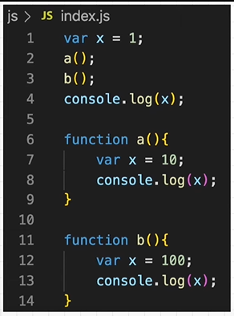

- **At line-2 :** New execution context is created  at function a( ).

- Js search value of x in local memory space and prints in console.

- After execution the program execution context will get popped out of the call stack.

- Now controls goes to line-2

- **At line-3:** After that control goes to line-3. And again a new execution context is created.

- After execution the program execution context of function b( ) will get popped out of the call stack.

- Now control goes to line 3.

- **At line-4:** after line-3 it goes to line-4.

- It looks for the value of x in local storage.

- Value of x is printed in the console.

- After execution of the whole code global execution context gets deleted from the call stack.

## **5. SHORTEST JS Program 🔥window & this keyword | Namaste JavaScript Ep. 5**

### **5.1 Global Execution Context and window object in JavaScript**

- When an empty Js file is executed, a global execution context is created and sets up memory space by Javascript.

- It also creates something known as a window.

- **Window** is like a big object with a lot of functions and variables. These are created by the Javascript engine. These functions and variables can be accessed anywhere in global space.

### **5.2**** Introduction to this keyword in browser**

- At global level “**this”** points to the **window **object.

- Window is a global object which is created along with the global execution context.

- Whenever a Javascript program is executed a global execution context and global object(window) is created along with this “**this**” variable.

- Js runs in browsers and also in devices.

- Js runs with the help of js engine.

- Js engine present in chrome is called **v8 engine**. Every browser has its own engineer to run Javascript.

-  All Js engines will have responsibility to create this global object. In the case of browsers it is known as **window**.

- Even though the code file is empty Js engine creates a global object(Window).

- At global level at the global execution context this is equal to window object.

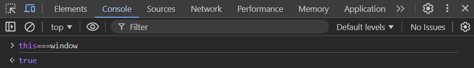

- Whenever a global execution context is created then **“this”** is created along with it even for the **functional execution context**.

### **5.****3 Code example of variables and functions in Global Memory Space**

1. **Global Memory Space: **The memory space where variables and functions defined outside of any function are stored. This includes all code written in the global scope, making it accessible throughout the entire program unless shadowed by local scope variables.

- Anything not inside any function is the global space.

- a is in the global space and x is not in the global space.

- a can be accessed everywhere in the program.

- Whenever variables or functions are created in global space these get attached to global object(Window).

- Accessing those variables and functions

- Window.a search value of a global object.

- If the window is not given before “a” it is considered as “a” present in the global object.

- At global level **“this”** points to the window object.

- In case of x. x is not found in global space. Hence it is given that x is not defined is not defined in global space it is located in function.

## **6. undefined vs not defined in JS 🤔**

### **6.1 ****Code Example of undefined in JS**

- **Undefined**** **is a very special keyword in Javascript.

- Before executing js code Global execution context is created and allocation of memory  is done for variables and functions in the code even before the single line is executed.

- Undefined is like a placeholder which is kept in the memory of a particular variable during the memory creation phase.

- Undefined is like taking memory. It is different from not defined.

- Undefined is the value which is allocated by Js engine while creating the memory for the variable.

- Undefined is a special keyword. It takes up its own memory. But you can assume it as a placeholder for time being until the variable is assigned by some value.

- Accessing `a` before the assignment results in `undefined` because of hoisting. After the assignment, `a` holds the value `10`.

### **6.2 Code Example of not defined in JS**

- Not defined means memory is not allocated for the variable.

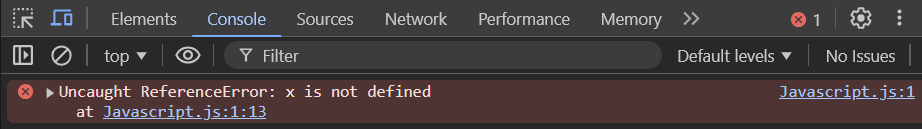

### **6.3 undefined vs not defined demo using code**

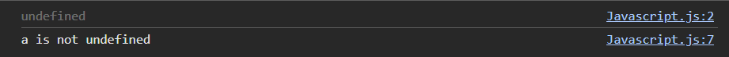

### **6.4 JS is a loosely typed language also know as weakly typed language**

- Javascript is a loosely typed language.

- It does not attach its variables to any data type.

- A variable can store anything string, boolean, integer.

- It can hold any value.

- Javascript is known as a loosely typed language and it is also known as a weakly typed language.

### **6.5 Mistake you should not make while using undefined**

- You should not initialize undefined to a variable.

- It will lead to some inconsistency.

- It is not a good practice.

## **7. The Scope Chain, 🔥Scope & Lexical Environment**

- Scope is directly related to the lexical environment.

### **7.1  Code Example for understanding Scope**

    ** eg-1:**

- Javascript tries to find the value of b in local memory of the function a( ) execution context.

- Global variables are accessed globally in the whole program.

       **eg-2:**

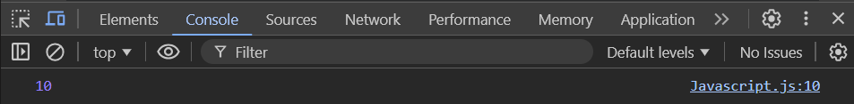

      **Eg-3:**

### **7.2 Understanding the meaning of Scope**

- Scope : Where a variable or function can be accessed in a code.

    **Eg-3:**

- Scope of variable b that means where can b is accessed in code.

### **7.3 Diving deep into code & behind the scenes**

- 2 function invocation happens here.

### **7.4 Introduction to Lexical Environment**

- Whenever an execution context is created a lexical environment is created.

- Lexical environment is local memory along with the lexical environment of the parent.

### **7.5 What is the meaning of <code>Lexical</code>?**

- Lexical : it means sequence or hierarchy.

- c function is lexically sitting in a function. It is physically present in function a. Function a is lexically inside global scope.

### **7.6  Lexical Environment definition**

- Lexical environment is local memory along with the lexical environment of the parent.

### **7.7 Understanding Lexical Environment visually**

- Whenever execution context is created then reference of the lexical environment of parent is also included. Lexical parent of c is a.

- Lexical environment of a along with lexical environment of a is present in the execution context of function a.

- Orange thing pointing to the lexical environment of a’s parent which is the lexical environment of global.

- Execution context of c consists of the lexical environment of c along with the lexical environment of c’s parent(which is the lexical environment of a).

- Execution context of a consists of the lexical environment of a along with the lexical environment of a’s parent(which is the lexical environment of global).

- Execution context of global consists of the lexical environment of global along with the lexical environment of global’s parent.

- Lexical parent in global points to null because it has no parent.

### **7.9 How Scope and Lexical Environment works in JavaScript**

Eg-1:

- At line console.log(b) Javascript tries to find the value of b in local memory of c or lexical environment of c. it won't be found there because b does not exist in function c.

- Now the Javascript engine tries to find the value of b in the lexical parent of function c(which is a). It finds the value of b in the lexical environment of a.

- Suppose if the value of b is not present in the lexical environment of a. Then it searches in the lexical environment of the parent of function a(which is global).

- Suppose if the value of b is not present in the lexical environment of global. Then it searches in the lexical environment of a lexical parent of global(which is null). Then it gives b is not defined.

### **7.10 The Scope Chain in JavaScript**

- Scope Chain : scope chain is nothing but the chain of lexical environment and parent references is called scope chain.

- If the Javascript engine didn’t find the particular thing in the local memory then it goes to the next level of the scope chain. This whole chain of lexical environments is known as scope chain.

### **7.8 Quick Revision of Scope, Lexical Environment and the Scope Chain**

- Lexical environment is local memory along with the lexical environment of the parent.

### **7.8 Browser Demo of Lexical Environment & The Scope Chain**

## **8. let & const in JS 🔥Temporal Dead Zone | Namaste JavaScript Ep. 8**

### **8.1 Hoisting of let & const in JavaScript**

- let and const declares are hoisted. They are hosted differently than var declaration.

- These are in a temporal dead zone for the time being.

**Eg-1:**

- Variable b can be accessed before it is initialized.

- memory is allocated even before a single line of code is executed in javascript.

- Variable b is allocated with undefined. which is like a placeholder. This happens because of hoisting.

**Eg-2:**

- variable a can be accessed after initializing.  it cannot be accessed before initializing it like var declaration.

**Eg-3:**

- accessing a after initializing it.

### **8.2 Behind the Scenes of let & const hoisting in browser**

- In case of var declaration the variable is in global space. In case of let and const variables they are in some other space. They are not in the global space.

- let and const variables can be accessed only when they are initialized.

- Memory is allocated for let or const variables but they are stored in different space. They are not in the global object.

- Variable a is hoisted and it was in separate space.

- Accessing after initializing a(let variable)

### **8.3 Temporal Dead Zone in JavaScript**

- Temporal dead zone is when a let or const variable is hoisted and till it is initialized with some value. The time between that is known as temporal dead zone.

- The phase from hoisting and till it gets initialized with some value that phase is known as temporal dead zone.

- Before line 3 it is a temporal dead zone.

### **8.4 Reference Error explained in depth**

**Eg-1: **not defined

- Accessing a value which is not in current scope. We get a reference error. There is no reference of x. Hence it is given that x is not defined.

**Eg-2: **undefined

- ** **accessing variables before it is initialized**. **Memory is allocated for b before it is executed.

**Eg-2: **cannot access ‘a’ before initialization

- In case of accessing let and const variables before they are initialized it gives a reference error as cannot access ‘a’ before initialization. Variable a is in the temporal dead zone.

### **8.5 Relation of global object and variables var, let & const**

- Window object is a global object. var declarations are attached to window objects. Whenever they are initialized.

- In case of let and const declarations they are not attached to window objects. They maintain a separate storage. That is reserved space for let and const.

**Eg-1: **Accessing var declarations using window object

**Eg-2: **Accessing let and const declarations using window objects. It is undefined.

### **8.6 Duplicate redeclaration of let and const variables**

**Eg-1: ** Redeclaration of let or const declarations is not possible.

- It results in syntax errors.

**Eg-2:** We cannot use the same variable name in the same scope.

**Eg-2: **In case of var declarations redeclaration is possible.

### **8.7 Important Difference between let and const**

- const declarations are even more strict than let.

- const declaration behaves very much similar to let declaration. it is even more strict than let declarations.

- It behaves the same in hoisting.

- let declaration can be declared in code and it can be initialized later. In case of const it cannot be done. it results in syntax error.

- In case of const declarations they have to declare and initialize at a time.

### **8.8 Syntax Error in JavaScript**

- If a const variable is declared and initialized later than it results in syntax error.

### **8.9 Type Error in JavaScript**

- If a const variable is declared and initialized. If re-declaration of the same variable is done then it results in type error.

### **8.10 Difference between var, let or const?**

- Use const in the first place.  Whenever a value is needed which is not changed later then use const declaration.

- When there is no need to assign value to the same variable then use const declaration.

- By using const declaration we won’t run into unexpected errors.

- Let declarations  can also be used. let declarations have a temporal dead zone. It helps avoid unexpected errors like undefined. Which is the next priority.

- Prefer to use let and const declarations in day to day coding.

### **8.11 ****How to avoid Temporal Dead Zone**

- The temporal dead zone also leads to a lot of unexpected errors.

- In order to avoid temporal dead zones, always put declarations and initializations on the top of the scope. Then it hits the initializations first then it goes to logic.

- We are shrinking the temporal dead zone to zero while moving our initializations on the top.

## **9.   BLOCK SCOPE & Shadowing in JS 🔥| Namaste JavaScript 🙏 Ep. 9**

### **9.1 What is a block in JavaScript?**

- Block is defined by curly braces. Block is also known as compound statement. A block is used to combine multiple javascript statements into one group.

  **  eg-1: **

- Grouping multiple statements into a block allows us to use them wherever JavaScript expects a single statement.

- Block used to group multiple statements in javascript.

- Block is used to wrap multiple statements.

### **9.2 What is a Block Scope and Lexical Scope Chain?**

- **Block scope:** what all the variables and functions can be accessed inside the block is called block scope.

- let and const variables are stored in block scope. Hence let and const variables are block scoped. 

- They are stored in separate space which is reserved for the block.

- a is stored in the global scope. Memory allocation of a is done in global scope.

- let and const variables are not accessed outside the block. Whereas var variables can be accessed globally.

### **9.3 What is Shadowing in JavaScript?**

- In case of var declarations If there is a same named variable outside the block then the variable inside the block shadows the outside variable.

- Before executing var a=10 in block

- In case of var declarations If a is accessed outside the block then it takes the value which is inside the block because at line 3 value of a changes from100 to 10 in global space while printing it access a=10.

- In case of let declarations accessing value of let variable inside block If there is a same named variable outside the block then the variable inside the block shadows the outside variable.

- In case of let declarations Accessing value of let variable a outside the block. Memory is allocated for variable a inside the block is in block scope. Memory allocation of variable a of let declaration outside the block is done in separate space(which is not in the global). 

- In case of functions shadow behaves in a similar way.

### **9.4 Illegal Shadowing in JS**

- It is not possible to shadow let variables inside the block using var and vice versa. This is **illegal shadowing**.

- We can shadow let using a let.

- Var is function scoped.

**9.5 Lexical Block Scope with Code Examples**

- Block scope also follows lexical scope. It again follows lexical scope chain patterns.

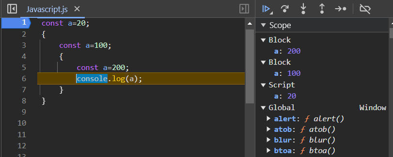

**9.6 Arrow Functions Scope and the**

- All the scope rules which work on functions are exactly the same in case of arrow functions.

## **10. Closures in JS 🔥 | Namaste JavaScript Episode 10**

### **10.1 What is Closure?**

- A closure is the combination of a function bundled together (enclosed) with references to its surrounding state (the lexical environment). In other words, a closure gives a function access to its outer scope. In JavaScript, closures are created every time a function is created, at function creation time.

- A function binds together with its lexical environment.

- Closure is a function bundled with a lexical environment.

- Function along with its lexical scope forms closure.

- Function y was bound to the variables of x.

- Functions are the heart of javascript.

- Function can be assigned to variables in javascript.

- Function can be passed as parameters to other functions in javascript.

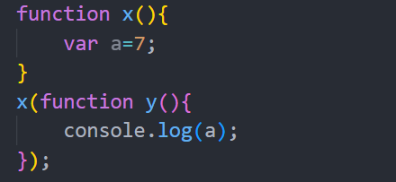

- Function can be returned from functions in javascript.

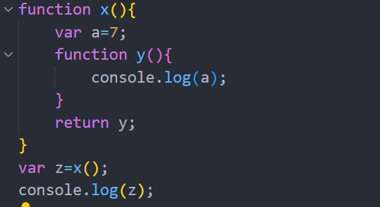

### **10.2 Invoke a Function**

- Function can be returned from functions in javascript.

- It returns y where x is invoked. it returns the function y.

- Once y is returned then x execution context is gone from the call stack.

- When functions are returned they still maintain their lexical scope.

- Y function remembers its lexical scope. Hence it prints the value of a.

- When y is returned the whole closure was returned.

- Function y and along with its lexical scope is returned.

**Alternative for above code**

### **10.3 Corner Cases**

- A function with the reference to the variables is returned.

**eg:**

- Accessing parents' parents' closure.

- Function z forms a closure with scope of x and y.

- If function z is returned outside then it would retain the value of a and b. Because function z forms a closure with scope of function x and y.

### **10.4 Uses**

- They are used in module design patterns.

- Currying is possible with closures in JS.

- Functions like once(which can run only once)

- Memoize -

- Maintaining state in async world.

- setTimeout + Closures Interview Question 🔥 | Namaste 🙏 JavaScript Ep. 11setTimeouts

- Iterators

- And many more

## **11. setTimeout + Closures Interview Question 🔥 | Namaste 🙏 JavaScript Ep. 11**

### **11.1 setTimeout function example**

- Function inside the setTimeout forms a closure and remembers reference to i.

- Wherever function goes it takes the reference of i along with it.

- console.log(“namaste Javascript”) executes first. It will not wait for the setTimeout function.

### **11.2 How setTimeout actually works in JS?**

- It takes a callback function and stores it somewhere and  attaches a timer of specific time to it.

- Once the timer expires it takes the function and puts it into the call stack and runs it.

- When the timer expires then it calls the callback function.

### **11.3 Most asked Tricky JS Interview Question(printing 1 after 1 sec, 2 after 2 sec..so on)\**

**Eg-1:**

- It prints this way because of the closure.

- A closure function along with its lexical environment.

- Even if a function is taken from its original scope and executed in another scope still it remembers its lexical environment.

- Function inside setTimeout refers to the same reference (it refers to the same memory space) to i not the value of i.

- Javascript stores all the functions one by one and it moves on. It will not wait for the timer to expire.

- When the timer expires it is too late. When the call back function runs by that time i=6. That's the reason it prints 6 in all cases.

### **11.4 Solution to the problem**

- We can fix this by using let declarations.

- Whenever every time loop runs this i is a new variable altogether. It's a new copy of it altogether.

- Each time the function in setTimeout is called it is referring to a different location.

- Let variables  are block scoped. It creates a new copy for every iteration.

### **11.5 Extension of the interview question**

- What if let is not allowed to solve this problem but we have to use var instead?

- By using closure it can be solved.

- Everytime close function is called with i it creates a new copy of i every time it is called.

## **12. CRAZY JS INTERVIEW 🤯ft. Closures | Namaste 🙏 JavaScript Ep. 12**

### **12.1 What is a Closure in JavaScript?**

- Closure is a combination of function and its lexical scope bundled together forms a closure.

- Even when a function is executed in other scope not in its original scope it still remembers its outer lexical environment  where it is present in the code.

**Alternative: **calling inner function

### **12.2 ****Are Let declarations closed over?**

- Let is blocked scope. It is not accessed outside the outer function.

- In the case of below example inner function forms closure which can access let variable.

- It gives the same result as var declaration.

### **12.3 ****Are function parameters closed over?**

- What if the outer function takes a parameter?

- Inner function forms the closure with outer function hence b is part of outer environment. Inner function forms closure with b also.

- Inner function access b.

### **12.4 ****Relation of Scope Chain and Closures**

- Will the inner function can access a variable  which is in the outer function parent lexical environment if the outer function is nested with another function?

- Will inner have access to the outest function?

- Inner function forms closure with that function also.

### **12.5 ****Conflicting name Global variables in JS**

- If a global variable is declared with conflicting names let then what happens.

- Inner function has access to the inside of the closure. Variables in global are completely different.

- If the inner function does not find a in closure or if it did not find in scope chain then by default it accesses variable a in the global. 

- It checks in all hierarchy of the function if it is not found it goes to global.

### **12.6 Advantages of Closure**

- It is used in module pattern.

- It is used in function curry.

- It is used in some higher order functions (ones).

- It is used in data hiding in encapsulation.

### **12.7 Data Hiding & Encapsulation in JavaScript?**

- If we want data privacy over a variable which other functions  or pieces of code cannot have access to that particular data.

- Encapsulation is used to hide data.

### **12.8  Example of Data Privacy using Closures**

- Closures are used to hide data or encapsulation.

- Counter cannot be accessed by anyone in the global.

- Variable count is encapsulated by a function If someone accesses the variable count outside it gives an error.

- Variable count is hidden.

- What if the counter function is invoked twice?

- Another counter is made.

- It will be a fresh or new counter. It will not touch the previous scope.

### **12.9 Function Constructor in JavaScript**

- Is the code good and scalable? What if decrement of counter is needed.

- We can use constructors for increment and decrement of counter. 

- Fot constructor function we have to use a new keyword.

- We can increment and decrement the counter.

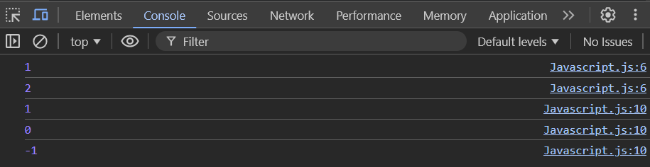

### **12.10 ****Disadvantages of Closures?**

- There could be over consumption memory in closures.

- Everytime closure is formed it consumes a lot of  memory.

- Those closed over variables are not garbage collected till the program expires.

- If it is not handled properly it can lead to memory leak. Memory is accumulated over time and freezes the browser.

### **12.11 ****What is a Garbage Collector in JavaScript?**

- Garbage collector is the program in the browser or javascript engine which frees up the unutilized memory.

- In the case of the js it is a high level programming language most of the work is done by js engine. There is a garbage collector in the js engine which frees up the unutilized memory(variables which are no longer needed).

### **12.12 ****Relation between Garbage Collection, Memory Leaks, and Closures?**

- If execution of a function is completed then the memory of the function vanishes but in case of closure memory will not be freed up.

### **12.13 ****Example of Smart Garbage collection by V8 JS Engine in Chrome**

- Some of the modern browsers like js engines(v8) basically have smart garbage collection mechanisms which smartly collects the unreachable variables.

- z is not used in the code so z is collected by the garbage collector in the code.

- Inner function b forms closure with x and z but z is not used hence z is gone from the memory.

- When the execution of a is completed z is garbage collected.

### **12.14 Important Points**

1. An inner function can be directly called using two parenthesis ()().

2. Even parameters can be passed this way (Remember that the function needs to be returned to do this)

3. Closures can also be used for data hiding and encapsulation. So other code cannot access this value.

4. Unused variables are automatically deleted in High Level Programming language by garbage collector. Closures allocate a lot of memory which cannot be deleted so this acts as a disadvantage.

5. Some browsers now have smart garbage collectors that automatically delete variables that are not used outside closures.

## **13. FIRST CLASS FUNCTIONS 🔥ft. Anonymous Functions | Namaste JavaScript Ep. 13**

### **13.1 What is a Function Statement and expression  in JS**

1. **Function Statement - **Using the `function` keyword followed by the function name to create a function is called a function declaration.

- A function statement is more accurately referred to as a function declaration.

- **Function expression**

- Function can assign to variables also. Function acts like value.

### **13.2 Difference between function statement and function expression**

- Hoisting is a major difference between function statement and function expression.

- When a function is called before creating it executes without any memory allocated for it.in case of function statement.

- During memory creation memory is allocated for variable a and function is assigned to a.

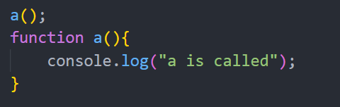

- In case of function expression b is treated like any other variable. It is assigned undefined initially until code the var b. At line var b the function is assigned to b.

### **13.3 What is a Function Declaration?**

- Function statement is also known as a function declaration.

### **13.4 Anonymous Function**

- A function without a name is known as an anonymous function.

### **13.5 Syntax Error & Anonymous functions**

- Anonymous functions do not have their own identity.

- Anonymous cannot be created like a normal function. If they are created like this it results as syntax error.

- Function statement requires a name.

### **13.6 Use/ Advantages of Anonymous Functions**

- Anonymous functions are used in a place where functions are used as values.

- They are assigned to some variable.

### **13.7 What are Named Function Expressions in JS?**

- Named function expression is the same as function expression but the function has a name instead of an anonymous function.

- A function with a name can be put in an expression.

- A function with a name can be put in an expression.

### **13.8 Corner Case Gotcha using Named Function Expression**

- When we call a function by its name in the named function expression it gives a referenceError.

- The named function is not created in the outer scope or global scope but it is created as a local variable.

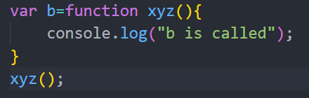

### **13.9 What is the difference between Parameters & Arguments?**

- **Parameters** - The values defined in a function's definition are called parameters. They act as local variables or identifiers within the function.

- **Arguments** - The values passed to a function when it is called are called arguments.

- Function can be passed as arguments to other functions.

- They can be received at parameters.

**eg-1:**

**eg-2:**

- A function can also be returned.

- Returning anonymous function.

### **13.10 First-Class Functions in JavaScript**

- **First-class functions** - The ability of functions to be treated as values, assigned to variables, passed as arguments to other functions, and returned from functions is known as **first-class functions**.

### **13.11 Functions are First-Class Citizens**

- Ability to be used like value makes the function as first class citizens in javascript.

- the ability of functions to be treated as values, assigned to variables, passed as arguments to other functions, and returned from functions makes the functions as the first class citizens.

- If functions are stored in variables with let and const declarations then it behaves the same as let and const variables declarations.

### **13.12 Info about Arrow Functions**

- Arrow functions come as part of ES6.

## **14. Callback Functions in JS ft. Event Listeners 🔥| Namaste JavaScript Ep. 14**

### **14.1 What is a Callback Function in JavaScript?**

- Functions are first class citizens in javascript. A function can be passed into another function. It is called a call back function.

### **14.2 Advantages of Callback**

- It gives access to the whole asynchronous world in synchronous single threaded language.

- It can do one thing at a time with specific order.

- By using call back function async can be done.

**eg-1:**

- y is a callback function.

- it is upto x when it wants to call y.

- setTimeout( ) takes a callback function.

- The first parameter to the setTimeout() function is the call back function.

- The second parameter is time.

- setTimeout function takes the callback function and stores it in separate space and time is attached to it.

- js will not wait for 5000 ms sec to complete it goes to the next line.

- function x is called and inside x it prints what is inside the console and calls y.

- after calling y it is executed.

- After some time 5000ms expires then the callback function is executed or called.

### **14.3 Callback - dev tools Demo in browser**

- After executing x and y then the call stack gets cleared. After 5 sec callback function execution context comes into call stack.

### **14.4 Blocking Main Thread in JavaScript**

- Everything in js is executed in the call stack.

- If any operation blocks the call stack that is known as blocking the main thread.

- If a function has heavy operation which takes 30s suppose then js will execute anything in this duration that means everything will be blocked in the code.

- In order to not block the main thread by using Async operations for things which take time just like  setTimeout( ) function.

- setTimeout takes the callback and executes after sometime and it just comes out the call stack.

- Without first class functions and callback functions asynchronous things cannot be possible.

- Using web api’s, setTimeout( ) functions and callback functions asynchronous operations can be achieved.

### **14.5 Creating an Event Listeners in JavaScript**

- for one click it calls a function.

- The function inside an event listener is a callback function.

- if a button is clicked and an event happens then the callback function is called.

- callback functions come into the call stack after an event has happened.

- whenever a button is clicked then the callback function is pushed into the call stack and executed.

- callback function inside event listener function forms closure with count variable.

### **14.6 Closures along with Event Listeners**

- Printing how many times the button is clicked.

- Creating closure around the eventListener function for counting the number of clicks has happened.

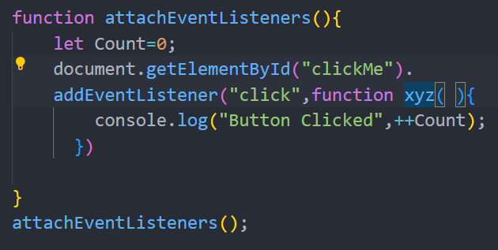

- the xyz function inside the addEventListener( ) function had access to the closure. Call back function remembers the count inside the closure.

- Click event listeners are added to the button.

- click on elements -> Event Listeners -> see details of html code(closures details)

- Callback function inside event Listeners have access to the global scope and scope inside closure also.

### **14.7 Garbage Collection & remove Event Listeners**

- Why do we need EventListeners?

- EvenListeners are heavy. They take memory.

- It is necessary to remove EventListeners when they are not used.

- Page goes slow because of many closures occupied by the memory. All the callback functions hold scopes in closure. It is good practice to remove EventListners.

## **15. Asynchronous JavaScript & EVENT LOOP from scratch 🔥 | Namaste JavaScript Ep.15**

### **15.1 How JS Engine Executes the Code using Call**

- Javascript is a synchronous single threaded language.

- It has one call stack that can do one thing at a time.

- All the code executed in the call stack.

Eg-1:

- For every program global execution context is created and pushed into the call stack.

- Whole code runs line by line in a global execution context.

- For every function invocation new execution context is created and pushed into the call stack.

- While invoking function a( ) in code a new execution context is created and pushed into the call stack.

- After executing function a() the execution context of function a( ) is popped out of call stack.

- After executing the function a( ) control goes to the next line. It prints the next line.

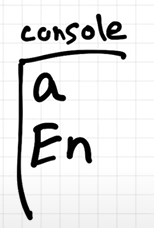

- After executing everything global execution context is popped out of the call stack.

### **15.3 Main Job of the Call Stack**

- The main job of the call stack is to execute whatever comes inside of it.

- It quickly executes whatever comes into it.

### **15.4 How does JavaScript perform async tasks**

- What if we need to wait for something in javascript code?

### **15.5 Behind the Scenes in Browser**

- Call stack is inside the javascript engine.

- Js engine is in browser(red box)

- Browser also has local storage, timer etc.

- Browser also has a url box and it has power to connect to servers.

- It can also display on UI.

- It also had access to bluetooth access, geolocation access etc.

- In order for these web api’s a connection is needed.

### **15.6 Web APIs in JS**

- Web API’s in Javascript.

- These API’s are not part of Javascript. These are part of browsers.

- Browser gives access to all the API’s inside the js engine for using them.

- Browser given access to DOM tree by DOM API’s.

- We can use these API’s because of the global object(window).

- window is the global object.

- Browser gives js engine facility to use or access all the web API’s through a keyword known as window.

- In order to access the setTimeout( ) web API use window.setTimeout( ) in js code.

- There are a lot more web API’s.

- These web API’s are in window objects they can be directly used without writing “window.” because they are in a global execution context.

- Browser wraps all the web API’s into a global object window and provides access to the window to the call stack.

### **15.7 How setTimeout Works behind the scenes in Browsers**

eg-1: executing the code and see how web API’s work.

- When code is executed in js global execution context  is created and pushed into the call stack.

1. At line **console.log(“Start”)**

2. At line console.log(“Start”) it uses the console API and it internally logs content on the console.

3. Console api plugged through the window to js code.

2. At line **setTimeout() **function

4. ** setTimeout( )** will use the setTimeout( ) web API and it gives access to the timer feature of the browser.

5. It takes the call back function and some delay.

6. When the call back function is passed to the setTimeout( ) function it basically registers the call back.

7. Because the delay is passed in setTimeout( ) function it also starts timer of 5000ms inside the timer.

8. Then js moves to the next line. It will not wait for anything.

3. At line **Console.log(“End”)**

- It logs the content into the console.

- After executing each and every line global execution context is popped out of call stack

- As soon as the timer expires, the callback function needs to be executed.

- Js is executed inside the call stack. So somehow we need callback function inside the call stack for execution.

### **15.8 Event Loop & CallBack Queue in JS**

1. **Event Loop** - it checks the callback queue and puts the callback function inside the call stack if the callback function is present in the callback queue.

- Callback is registered and the timer is running. As soon as the timer expires call back function needs to executed inside call stack

- Execution context of callback function inside setTimeout( ) goes to call back through call back queue

- After the timer expires the callback function moves to the call stack through the callback queue.

- Event loop acts like a gatekeeper.

\

- it checks the callback queue and puts the callback function inside the call stack.

- In the execution context, the **callback** function is runned line by line.

- At the console it calls the console web API  and it logs the content in the console.

### **15.9 How Event Listeners Work in JS**

1. `addEventListener()- ` is another powerful feature provided by the browser to the JavaScript engine through the `window` object as part of the DOM API, which is a Web API.

Eg-1:

- Whenever js code runs global execution context is created and pushed inside the call stack.

- At **line 1** - it calls the console web API method and logs the content on the console.

- At **line-2 -** it calls the DOM API which basically in turns fetches something from the DOM.

- addEventListener( ) accepts the callback function as argument.

- addEventListener( ) registers a call back on event **click**.

- Click event is attached call back.

- Call back will be registered in the web API environment.

- After attaching the click event to call back it moves to the next line.

- At **line-5 **it calls the console web API and logs content on it.

- After executing every line global execution context is popped out of the call stack.

- Event listener remains there until it is removed explicitly or closer to the browser.

- Call back registered in the web API sits in the web API environment and waits for the click.

- If a button is clicked then it moves to the callback queue and the event loop sends the call back function into the call stack for execution.

### **15.10 More about Event Loop**

1. **Event Loop** - it checks the callback queue and puts the callback function inside the call stack if the callback function is present in the callback queue.

- It continuously monitors the call stack and callback queue.

- If the call stack is empty and if the event loop sees there is also a function waiting to be executed in the callback queue it takes the callback function and pushes it into the call stack.

- Then the callback function is executed quickly.

- After execution call back function execution context is  popped out of the call stack.

### **15.11 Why do we need Event Loop**

The **event loop** is a crucial part of JavaScript's runtime environment. It enables **non-blocking**, **asynchronous programming** in a

single-threaded environment, making JavaScript efficient for I/O-bound and event-driven tasks. Here's why the event loop is essential.

eg:

- addEventListener(  ) example

- If a user clicks a button for more than one time in the previous example  then the callback function is pushed each time into the callback queue.

- Event loops take the callback functions one by one and put them into the call stack for execution.

### **15.12 How fetch() function works**

- fetch( ) works differently.

- fetch( ) go and request a api call.

- It returns a promise. A callback function is passed which will be executed once the promise get resolved.

- Global execution context is created and pushed into callstack.

- At line 1 it calls console web API which logs content on console.

- At line 2 setTimeout( ) will register the call back in the Web API environment and attach the timer to it. Timer starts here.

- It moves to the next line. It will not wait for the timer.

- At line 6 we come to the fetch function. Fetch is a web API which is used to make network calls.

- It also registers the callback function in the web API environment.

- Callback function of the setTimeout function(CBT) is waiting for the timer to expire so that it moves to the callback queue.

- Callback function of the fetch function is waiting for data to be returned from netflix servers.

- Fetch function makes a call to network servers and network servers return the data to fetch. Once data is revived the callback is ready for execution.

### **15.13 MicroTask Queue in JS**

- **Micro task queue** - it is similar to callback queue. But it has higher priority.

- Whatever functions come inside the micro task queue executes first.

- Callback function of the fetch()  function comes into the micro task queue.

- Callback function of setTimeout moves to the callback queue.

- After executing the all lines then the global execution context popped out of the call stack.

- Eventloop monitors the call stack if it is empty it sees all the pending tasks and pushes it into the call stack.

- Micro task queue has higher priority. CBF function gets a chance to get inside the call stack.

- Execution of the callback function of fetch happens.

- It logs the content console.

- After execution of CBF it is popped out of call stack

- Event loop monitors the call stack. It checks the callback queue for the next task.

- It takes the callback function of setTimeout and pushes it into the call stack.

- CBT function goes into the call stack. CBT function is executed and logs content on console and whole code will be executed.

- After execution, the CBT function popped out of the call stack.

### **15.14 What are Micro Tasks in JS**

- **Micro task queue** - it is similar to callback queue. But it has higher priority.

- What can come inside the micro task queue?

- All the callback functions which come through **promises** will go inside the** micro task queue**.

- **Mutation observer **- it keeps on checking whether there is mutation in the DOM tree or not.

- If there is a mutation in the DOM tree it can execute some callback function.

- All the callback of the web API goes into the call stack through the callback queue.

- Callback queue also known as task queue.

### **15.15 Starvation of Functions in  Callback Queue**

- If a micro task creates another micro task in the micro task queue the callback queue will never get a chance to execute. This is known as starvation.

- Micro tasks have higher priority.

## **16. JS Engine EXPOSED 🔥 Google's V8 Architecture 🚀 | Namaste JavaScript Ep. 16**

### **16.1 JavaScript Runtime Environment**

- Javascript can run inside a browser, server etc.

- It’s possible with a javascript runtime environment.

- Javascript runtime environment is like a big container which has all things required to run javascript code.

- Javascript runtime environment has a JS engine, API’s(to connect to the outer environment), event loop, callback queue, Micro task queue.

- Which has all the things to run javascript code.

- Javascript engineer is the heart of the javascript runtime environment.

### **16.2 Browser and Node.js JS Runtime**

1. **Browser**

- Browser executes js code because it has a javascript environment.

- **Node.js**

- it also has a javascript runtime environment.

- It is an open source javascript runtime.

- It has everything which is required to run js code.

- It runs the js code outside the browser.

- Api’s may be different or same for browsers and node.js.

- Javascript is capable of running in a lot of devices just because of the js runtime environment.

- **setTimeout** API is the same in the runtime environment of browser and node.js. But internally they are implemented differently.

### **16.3 List of JavaScript Engines**

- All browsers have their own javascript engines.

- Chakra - Microsoft javascript engine

- Spidermonkey - firefox javascript engine

- V8 - chrome javascript engine.

- Main protocol for creating a js engine is to follow ECMAScript standards.

- ECMAScript - governing body of javascript

### **16.4  First JS Engine ever created**

- Frst js engine was developed by the creator of the js - Brendan Eich.

- Now it is known as spidermonkey which is used in the firefox browser..

### **16.5 Myths about JS Engine - inside JS engine**

- The JS engine is not a machine.

- JS engine is nothing but code written in low level language.

- The V8 engine is written in C++. It is written by engineers.

- This code(JS engine) takes high level code and splits out machine level code.

### **16.6 JS Engine Architecture**

- What happens inside the JS engine.

- Js engine takes human readable code(high level language).

- This code goes through three major steps

1. **Parsing -**

- During the parsing phase the code is broken down into pieces.

- **Syntax Parser** - it takes the code and converts it into an Abstract Syntax Tree (AST).

- Abstract Syntax Tree (AST), is a tree representation of program source code.

- AST generated passed into the compilation phase.

- [https://astexplorer.net/](https://astexplorer.net/)

- Compilation  and execution goes hand in hand.

- **Compilation**

- JIT Compilation - Interpreter + compiler

- AST goes into interpreter. Interpreter converts high level code to bytecode. That bytecode moves to the execution step. While converting from high level to bytecode. it takes the help of the compiler.

- While interpreting code line by line, the compiler optimizes the code line by line.

- The job of the compiler is to optimize the code as much as it can on the runtime.

- AOT (Ahead of time compilation) - it is present in some js engines.

- Compiler takes the code which is later executed and optimises it. It also produces the byte code then it goes to the execution phase.

- **Execution**

- Execution is not possible with two major components of js engine.

1. **Memory heap**

2. **Call stack**

- Call stack is present in js engine.

- Execution contexts are present in call stack while executing js code.

- Memory heap - memory for variables and functions are  stored in the memory heap.

### **16.7 Syntax Parsers and Abstract Syntax Tree**

- **Syntax Parser** - it takes the code and converts it into an Abstract Syntax Tree (AST).

- Abstract Syntax Tree (AST), is a tree representation of program source code.

- It generated the whole tree-like structure.

### **16.8 Compilation & Execution of JS Code**

- Compilation  and execution goes hand in hand.

### **16.9 Just In Time Compilation**

- Javascript has just in time compilation(**JIT**).

- **Interprete**r- it takes code and executes code line by line. I don't know what will happen in the next line.

- **Compiler **- it compiles code before executing it. After compiling new code is formed which is the optimal version of the code. Then it is executed.

- Which runs very fast and it has a lot of performance improvement.

- In case of interpreters, code is fastly executed. It does not wait for code to be compiled first.

- In the case of a compiler it has more efficiency.

### **16.10 Is JavaScript Interpreted or Compiled Language?**

- Javascript is an interpreted and compiled language. It is dependent on the js engine.

- JS is the just in time compiled language.

- Initially it is interpreted language.

- In today’s world most of the  modern browsers or js engines use both compiler and interpreters together.

- Now it is dependent on the js engine(whether it is purely interpreted) or just in time compile.

- JIT Compilation - Interpreter + compiler

- JIT uses an interpreter and compiler to execute the code.

- Compilation  and execution goes hand in hand.

- **Compilation** - 

- AST goes into interpreter. Interpreter converts high level code to bytecode. That bytecode moves to the execution step. While converting from high level to bytecode. it takes the help of the compiler.

- While interpreting code line by line, the compiler optimizes the code line by line.

- The job of the compiler is to optimize the code as much as it can on the runtime.

- AOT (Ahead of time compilation) - it is present in some js engines.

- Compiler takes the code which is later executed and optimises it. It also produces the byte code then it goes to the execution phase.

### **16.11 Garbage Collector - Mark & Sweep Algorithm**

- Memory heap - memory for variables and functions are  stored in the memory heap.

- **Garbage Collector** - it tries to free up memory space whenever possible.

- It uses a **mark and sweep algorithm**.

- There are many optimizations which compilers do while compiling the code.

- **Copy Elision Optimization** 

- **Inlining** 

- **Inline Caching** 

### **16.12 Fastest JavaScript Engine**

- Google v8 engine is fastest among all js engines.

- Read v8 blog.

- It has an interpreter known as **Ignition.**

- It has a compiler known as **turbo fan.**

- It has a garbage collector known as** orinoco and **another one which is known as** oil pan(which is used for other purposes)**

### **16.13 Google's V8 JS Engine Architecture**

## **17. TRUST ISSUES with setTimeout()**

### **17.1 Introduction**

- setTimeout( ) function will not wait for a specific given time always.

- It will not guarantee that the call back function will be called exactly after a specific time.

- It depends on the call stack.

### **17.1 Why do we have trust issues with setTimeout?**

- Global execution context is created when js code runs.

- Function inside the setTimeout function is registered in the web API’s environment and it starts a timer of 5000ms.

- Function waiting for timer to expire for its execution.

- Js will not wait for anything it prints the next line.

- If there are 1 million lines of code after the line console.log(“end”) .

- it takes 10 secs then the timer of the call back function expired long back. Callback function is pushed into the callback queue. Event loop checks the callback queue and if the call stack is empty then it keeps the callback function in the call stack.

- It will wait for global execution context moves out call stack Callback function gets chance to execute after 10 sec.

- This is also known as **concurrency model** in Javascript.

- After 10 sec the callback function is kept into the call stack by eventloop.

- Main thread should not be blocked.

### **17.2 Code demonstration of the setTimeout delay**

- Blocking the main thread with help of code.

- Write a code to block the main thread for some time.

**eg-1:**

- the end date is updated with the present date.

- Start and end printed first and callback function is setTime function is registered in web api’s environment. It waits for 5 sec to get executed.

- While loop takes 10 sec to execute.

- 5000 ms expired long back and after 10 sec the** “while expires prints” **on console.

- After 10 sec the callback function will be executed.

- **setTimeout does not guarantee that it takes exactly specific time to execute the callback function . It **guarantees that it waits for a specific time.

- Js is a single thread language. That’s why it is fast. It is lightweight.** It has just in time compiler** for executing code. 

### **17.3 Discussion about setTimeout(0)**

- Delaying a function for zero seconds.

- Even if the time is 0ms, the timer should go through that queue.

- setTimeout function will register a call back on the web API environment.

- Although the timer expires long back it moves into the call back queue once the call stack is empty.

- when gec is executed and popped out of the call stack then only the call back function will get executed.

- In order to defer a few pieces of code we use the setTimeout function with 0ms.

- Concurrency model is needed because Javascript is a synchronous single threaded language. With this model we can do asynchronous operations inside the single thread language.

- 
### **17.4 Set up practice playground on the local system**

1. VS Code

2. Chrome

3. Live Server

## **19. ****Higher-Order Functions ft. Functional Programming**

### **19.1 What are Higher Order Functions?**

- Functional programming is one of the amazing part of javascript.

### **19.2 Code demonstration of Higher-Order Function**

- A function which takes another function as argument or returns a function is known as higher order function.

### **19.3 Introduction to Functional Programming**

**Eg-1:**

- y takes the x function as the argument. y is the higher order function.

- y - **higher order function **

- x - **Callback function**

**Eg-2: **Calculating area of circle by the given radiuses.

**Eg-3: **Calculating circumference of circle

- It is not good practice to write code like this

### **19.4 Mistakes people make in a Coding Interview**

- Code is repetitive in the above example.

### **19.5 DRY Principle - Don't Repeat Yourself**

- There is a principle in software engineering which is known as the DRY principle.

- All three functions in the above example have the same code but logic is changing.

### **19.6 How to optimize our code**

- Function can be reused by passing logic to it. No need to repeat the code.

### **19.7 Beauty of Functional Programming**

- Functional programming - Making logic according to functions.

- Abstracted code into smaller functions. Each and every function has its own responsibility.

- By using function programming there is no need to repeat.

- Function programming deals with composite function, pure functions.reusability, modularity etc.

- In the interview this style code is preferred. Breaking logic into smaller function units.

### **19.8 ****Pollyfil**** for map function in JavaScript**

- Function calculate is exactly like a map function.

- Map function creates an array and iterates through each of the elements in the radius array and returns output.

- Watch[Prototype and Prototypal Inheritance in Javascript | Frontend Interview Question](https://www.youtube.com/watch?v=wstwjQ1yqWQ)

## **20. map, filter & reduce**

### **20.1  Array.map() function in JavaScript**

- map function is used to transform an array.

- Mapping each every value to another value and creating an array returning it into output.

**E****g-1:** Double elements of an array by using map function

- a function needs to pass into a map function.

**Eg-2:**Triple of elements of an array by using map function

- Triple transformation logic.

**Eg-3:** Binary of elements of an array by using map function

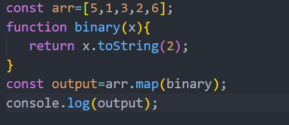

- A function can be passed as an argument of another function.

**Eg-4: Alternative **- using anonymous function.

- Return statement can be removed if there is one line of code.

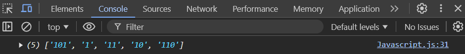

### **20.2 Array.filter() function in JavaScript**

- Filter function is used to filter the values in an array.

- filtering odd elements in an array - 5,1,3

- Filtering elements greater than 4 - 5,6

**Eg-1: **Filtering odd numbers in an array

**Eg-2: **filter** **elements greater than 4

**Eg-3: **filter even elements

**Alternative: **it filter when x is greater than 4

### **20.3   Array.reduce() function in JavaScript**

- It is used when there is a need to take all the elements and come up with a single value out of them. Like example

- Finding sum of all elements.

- Finding the maximum number in an array.

- Reduce function iterates each and every element of an array.

- The `reduce` method takes a function as its argument and an optional initial value, which is passed to the accumulator.

- This function has two parameters: the accumulator (`acc`) and the current value (`curr`).

- `curr` represents the current value in the array.

- `acc` accumulates the values (it stores the result or the intermediate value needed to get the final output).

**Eg-1:  **finding sum using **normal way**.

**Eg-2: **Finding sum using** reduce function**.

- Based on the above example acc is like sum and curr is like arr[i].

- Accumulator should be initialized with an initial value.

**Eg-3:**Finding max element using reduce function.

### **20.3 tricky map() example**

- Suppose data is received from api.

- Finding list of full names.

**Eg-1:**

### **20.4 ****tricky reduce() example**

- What are different ages in the given data and how many people are there of particular age.

- Age 26 - 2 users

- Age 25 - 1  user

- Ages 27- 1  user

### **20.5 ****Chaining map, filter & reduce**

**Eg-1**: First Name of all the people whose age is less than 30

**Eg-2:**

**Eg-3:**

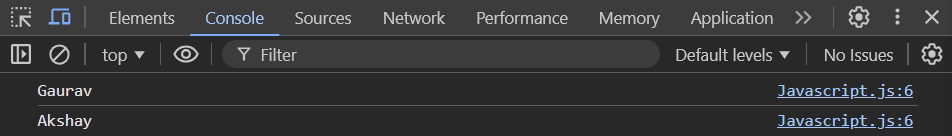

## **21. Callback Hell**

- Callbacks are important while writing asynchronous javascript.

- Use of callback causes issues. There are two major issues

1. Callback Hell

2. Inversion of control

- Javascript is a synchronous single threaded language.

- It can do one thing at a time. It has one call stack that executes one thing at a time.

- Whatever code is given to the js engine it will execute quickly. It will not wait for anything.

### **21.1 Callback Function**

- What if we really wait for something. Callback functions are used to do asynchronous tasks.

- Giving callback function to the setTimeout function. That function executes after a certain time.

- Using callback functions is a powerful way to do asynchronous things in javascript.

**Eg-1:**

**Eg-2:**

- **API’s required to Tasks**

1. **Creating Order**

2. **Proceed to Payment**

3. **Showing Order Summary**

4. **Update the wallet.**

- Create order - **api.createOrder( )** creates an order. 

- Api for proceeding to payment.

- Once an order is created then only it proceeds to payment.

- There is dependency between them. In order to manage dependency callbacks are used.

- Js calls the **createOrder** api.

- **proceedToPayment** function is given to **createOder** api . it is responsibility of createOrder api to call **preceedToPayment**** **function.

- Order summary is shown after payment.

- **showOrderSummary** API is created and given to **proccessToPayment** function.

- It is the responsibility of **proccessToPayment**api to call **showOrderSummary** function.

- After showing the order summary wallet is updated.

- updateWallet( ) is created and given to showOrderSummary function.

- When there is a large codebase and so many API’s dependent on one after the other it ends up falling into **Callback hell**.

### **21.2 Update the Wallet**

- updateWallet( ) is created and given to showOrderSummary function.

- When there is a large codebase and so many API’s dependent on one after the other it ends up falling into **Callback hell**.

- **Callback Hell** refers to a situation in programming, particularly in asynchronous JavaScript, where **multiple nested callbacks are used to handle asynchronous tasks**. This creates deeply nested and difficult-to-read code, making it challenging to debug, maintain, and scale.

- Code starts to grow horizontally instead of vertically.

- This code structure is difficult to read and maintain.

- This structure is called the **Pyramid of Doom**.

### **21.3 The Inversion of Control**

- Inversion of control is another problem that occurs while using callbacks.

- Inversion of control - losing control of your code using callbacks(Kyle Simpson check this)

- It is responsible for createOrder( )  API to Call proceedToPayment( ).

- createOrder API must have been in another service or another developer wrote it.

- There could be bugs in it.

1. Maybe the function inside may not be called.

2. What if the callback function is called twice.

- Whenever a piece of code is passed into another piece of code due to bugs in the function which takes this code it may not work as expected.

### **21.4 Recap**

1. **Importance of Callbacks**

- Super powerful way of handling asynchronous operations in javascript.

- Async javascript exists because callback exists.

- **Issues with callbacks**

- Two issues are raised while callbacks are used

1. **Callback Hell **- this issue occurs due to nested callbacks. The code becomes unmaintainable.

2. **Inversion of control **refers to losing control of the program's flow by passing it into another function, where control is handed over to another function that may potentially contain bugs.

## **22. Promises**

### **22.1 Code Example of Callbacks and Promises**

- Promises are used to handle async operations in Javascript.

**Eg-1: How things work before promises and after promises.**

- Cart contains some items.

- API’s required to do tasks

- **createOrder(cart)** - it creates order and gives order ID

- **proceedToPayments(OrderId) **- this api takes orderId and proceeds to payment.

- creatOrder and proceedToPayments API’s are asynchronous and their execution time is unpredictable. They are dependent on each other.

- Once order is created then only it goes to payments.

- Callbacks are a very crucial part when writing asynchronous code.

- proceedToPayments is passed into createOrder API. The responsibility of createOrder API is to create order and call the callback function once the order is created with order Id.

- **Code without promises**

- An issue may arise if a callback function is passed to another function, as this can lead to an** inversion of control**

- Passing the callback function to another function is not reliable. It may lead to inversion of control.  This api can’t be trusted blindly; it may have been written by some other developers or had some bugs.

- It may not call the callback function or function is called twice in some cases.

- This type of situation can be handled using promises.

- **Code with Promises**

- Desinie createOrder in such a way that it will no longer take a callback function.

- createOrder API takes cart details as a parameter and it returns a promise.

- Promises returned by createOrder API are captured by the **promise** variable.

- Assume a promise as an empty object with data value in it.

- This data value will hold whatever createOrder API returns to us.

- The **createOrder** API is an asynchronous operation that takes an unpredictable amount of time to execute.

- As soon as the createOrder API executes it returns us data with some undefined property Or empty value. Assume us an empty object or not defined at that moment.

- **createOrder** API creates an order and it gives order details and fills the object at a later point of time.

- Whenever the creatOrder API is created it returns a promise. It returns an empty object. After some time the empty object is filled with data automatically. It contains order details after async time it takes.

- Proceed to the payment function after receiving data.

- A callback function is attached to the promise object.

### **22.2 Promise.then function**

- When createOrder API is executed then it returns data with empty object empty property.After some time the empty object is filled with data automatically. It contains order details after async time it takes.

- Proceed to the payment function after receiving data.

- A callback function is attached to the promise object.

- By using** then( )** function callback function is attached.

- Once we have data inside the promise object, the callback function attached to it is automatically invoked.

**eg-1: Attaching callback function to a promise**

**Eg2: Passing callback function to another function**

### **22.3 Callbacks vs Promises**

1. **Passing callback function to another function**

- Before promises callback function are passed to an createOrder API and blindly trusting it. An issue may arise if a callback function is passed to another function, as this can lead to an** inversion of control.**

- **Attaching callback function to a promise**

- A callback function is attached to the promise object.

- By using** then( )** function callback function is attached

- In this case control of the program is with us. It will create and order and fill the promise object with the data. As soon as the promise object is filled with data it will automatically call the callback function and we will have control with us.

### **22.3  Importance of Promises**

- Promises provide a way to handle asynchronous operations with trust and reliability.

- Promises guarantee that the callback function will be called once the data is available inside the promise object.

- As soon as the data becomes available within the promise object, it automatically triggers the associated callback function.

- It will call the callback function just once.

- We have control of the program with us because the callback function is not passed to another external function.

### **22.4 ****Promise Object in Browser**

- Fetch is an API given by the browser to make external calls.

**Eg-1: **making API calls to github servers by using the fetch function to get user info.

- Fetching user info by this API.

- Fetch function returns a promise.

- Storing promise in variable user.

- Promise objects are stored in the user variable.

- Go to inspect and keep debugger on the promise object line and observe it.

1. **Before execute line 5**

6. It is undefined initially.

2. **After executing line 5 :**

- ** **as soon as the fetch function is called, a promise object is going to be returned inside the user object.

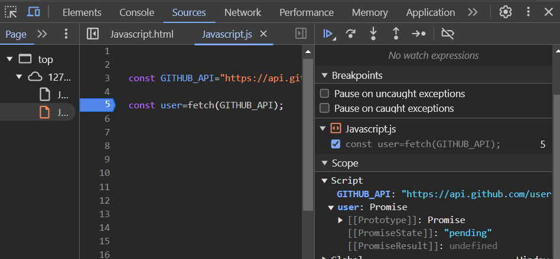

- There are two things related to promise

1. **State of a Promise**: This refers to the current status or phase of the promise. A promise can be in one of three states:

- **Pending**: The promise is still being processed.

- **Fulfilled**: The promise has been resolved successfully

- **Rejected**: The promise has been rejected due to an error or failure.

- The Initial promise is in pending state. Once the data is returned then the state of promise changes to a fulfilled state.

- **Result of a Promise**: This refers to the outcome of the promise after it has been fulfilled or rejected. It can be:

- **Value**: The result returned when the promise is fulfilled.

- **Reason**: The error or reason for rejection when the promise fails.

### **22.5 Deep dive into Promise States**

- When line-4 is executed at this point of time the user(promise object) is in pending state.

- Fetch returns a promise. That promise is in pending state. It takes some time to get data and fill it back to get fulfilled. Javascript does not wait until data is received but it executes **line-4. **The reason is the promise is pending at this point.

- After expanding it shows the current state of promise which is fulfilled.

- There is data inside the body. a readable stream can be converted into json and extracted.

- Attaching callback function to promise. Printing data on console. We can do anything with this data.

- **Promise **objects bring a lot of trust in transactions. JS guarantees that this promise is resolved only once. Either it is success or failure.

- A **Promise** is in one of these states:  

1. **Pending:** initial state, neither fulfilled nor rejected.

2. **Fulfilled:** meaning that the operation was completed successfully.

3. **Rejected:** meaning that the operation failed.

- **Promise** objects are immutable. When a promise is fulfilled the data inside it can be passed anywhere. There is no chance to mutate the data.

- There is a chance to attach handlers, there is no chance to mutate promise objects.

### **22.5 Promise Interview Question**

- **The Promise object represents the eventual completion (or failure) of an asynchronous operation and its resulting value.**

- A Promise object is a placeholder for a certain period of time until a value is received from asynchronous operation.

- A container for future value.

**Eg-1:**

- createOder is an asynchronous operation. It will eventually be completed.

- Inversion of control is solved using promises.

### **22.7 Promise Chaining in JavaScript**

- Many APIs are interdependent, which can lead to callback hell when their functions rely heavily on each other.

**Eg-1:**

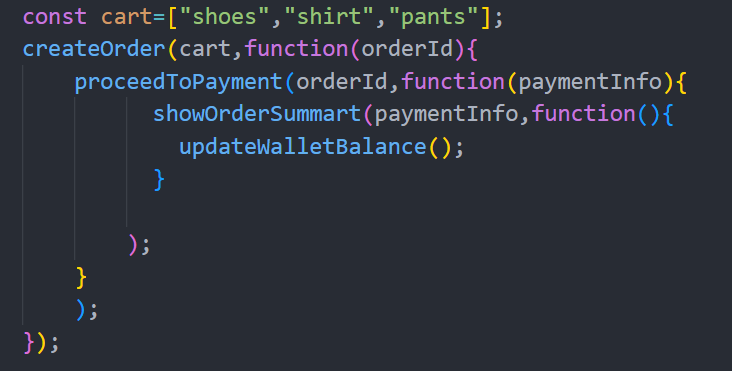

- Code grows horizontally instead of vertically. The code becomes ugly and hard to maintain.

- This was handled using **Promise Chaining**.

     **Eg-2**:Writing above code using Promise chaining

- **createOrder** API returns promise.

- Callback function is attached to the promise object.

- Code became lean by using promise chaining.

### **22.8 Common mistake while Promise Chaining**

- When many `then` or callback functions are attached in a promise chain, the data is piped from one function to another.

- When promises are chained, the `return` statement passes data from one function to another.

- Code does not grow horizontally.

- Some developers use arrow functions while chaining promises. It is more readable.

     ** Alternative: Promise chaining using arrow function**

- Promise chaining helps to get out of callback hell.

### **22.9 Important Points**

- When a promise is resolved then the callback function attached is automatically called.

- Promises give guarantee and trust in the whole transaction. Promises are resolved only once. It has three states - pending, fulfilled and rejected.

- Promises can pass everywhere without caring about the mutability of it.

- Promises has two properties

1. Promise State

2. Promise result.

5. Promises are immutable. They cannot be altered if they are resolved.

6. Callback Hell is addressed using Promise Chaining.

7. Inversion of Control is resolved using Promises.

8. When there is a promise inside the promise chain then it has to be returned inside the chain otherwise it leads to loss of some data.

## **23. Creating a Promise, Chaining & Error Handling**

### **23.1 Consuming Promises**

**Eg-1: **Ecommerce website example

- createOrder -  It takes a cart as input and it creates an order and gives an order ID.

- proceedToPayment - it takes orders and proceeds to payment.

- Callback function is attached to the promise. Which is called when a promise is resolved.

### **23.2 Creating Promise**

- How does creatOrder return a promise?

- **Developer**s will write createOrder promises.

- Creating new promises and sending them to consumers.

- createOrder function written by developers.

- Inside the createOrder function a promise is created and returned.

- Creating a promise is done at the producer end.

- To create a promise new keyword and Promise constructor is used.

- Promise constructor takes a function.

- This function has two parameters

1. Resolve

2. Reject

- **Resolve** and **Reject** are functions provided by JavaScript to create and manage promises. 

- They are part of the Promise API, designed by JavaScript.

- Logic of handling what is needed to do is  written inside the createOrder function.

- creatOrder will take the cart items and create an order.

- Generally cart is validated and makes API calls to create an order and then order Id generated. That will be returned as success.

- **Success **would be returning an** ****order Id**. 

- **Failure**** **would throw an **error**.

- A promise can be **rejected** or **resolved**.

- Resolve and Reject are functions passed by javascript to us.

1. **Rejecting Promise**

10. Creating errors in Javascript and reject promise by throwing error.

11. If the **Reject **function is called then the promise will be rejected. Whoever is consuming the API or calling `createOrder`, if the cart is not valid, the promise will be rejected and an error will be thrown.

12. If a cart received from the customer is not valid then the promise will be rejected. It will not create orderId.

13. Promise rejected by sending some error message

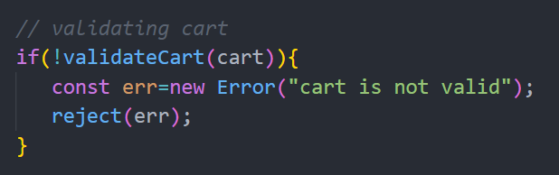

2. **Resolving Promise**

- Logic for createOrder is successful then orderId is generated.

- Generally orderId is fetched from the database. Here the orderId is given manually just for example.

- If the order is **valid** then make the promise resolved. 

- Promises can either be fulfilled, resolved, or rejected.

- **Validating cart logic**

- Checking whether the cart is empty or items proper or not like that. But now it just returns true for sake of simplicity.

- **Making a fake delay** **for sending orderId once the promise is resolved. **

- Resolving promise after 5 secs.

- **Printing Promise**

- Promise is pending when promises are resolved after sometime because the promise object is in pending state during that time.

**=> Code**

### **23.3 Promise Rejection**

- Rejecting a promise by returning false while validating cart.

- This error or exception has to be handled. It is falling inside the browser.

### **23.4 Error Handling**

- Code should be written to handle errors. If this code is pushed into production this will fail on the user's computer. They get an error in their computer.

- Error should be gracefully handled while writing code.

- Promise also comes with one more function **catch( )** just like then( ).

- Promises can be attached with failure callbacks as well. If a promise fails this callback will be invoked.

- Always catch statements are used to handle errors gracefully.

1. **Success part**

2. **Rejection part**

### **23.5 Promise Chaining**

- Taking the **proceedToPayment( )** into picture.

- With orderId it proceeds to payment.

- Once orderId is received it will be passed to the next one in the chain.

- **proccedToPayment( )** again returns a promise.

- proceedToPayment( ) function logic has to be written from the producer end.

- For simplicity, resolving a promise by writing **“payment is successful”**.

- Response of the promise is passed to the next one in promise chaining.

Advanced Promise Chaining

### **23.6 **** Advanced Promise Chaining**

- There is an error in the above code.

- In a promise chain, values returned in one `.then()` method are passed down the line to the next `.then()` method.

- Whatever has to pass down the chain needs to be returned from the top of the chain.

- Data or promise is returned by using a return statement.

- **Alternative for above code:**

- Writing like this leads to promise hell.

- The Promise API is designed to avoid the pitfalls of 'callback hell' by providing a cleaner and more structured way to handle asynchronous operations.

- It also helps prevent falling into 'promise hell' by enabling better management of asynchronous operations.

### **23.7 Advanced Promise Chaining**

- If there is an error in any part of the promise chain then catch( ) at the end of the promise chain will handle any error that is down in the chain.

- **If the cart is not valid it throws an error with an error message.**

- **If the cart is valid it proceeds to payment and if payment is successful it gives “payment successful message”.**

### **23.8 Advanced Error Handling**

- If one part of the chain fails then the entire chain fails.

- What to do even if you move to the next one even if something has failed in the promise chain?

- Add catch( ) statement to the one which fails. Then it concerns Whatever is above the catch( ) statement. It will not bother about the below statements.

- Errors that occur before a `catch()` statement are handled by it, but any errors that occur after the `catch()` statement will not be handled by it.

**Eg:** What if you go to payment even if the cart is not valid?(for example)

- Even after the cart fails it proceeds to payment.

- **In this case the then( ) after catch( ) is definitely called.**

- Individual `catch()` statements can be written for specific `then()` statements, while a general `catch()` statement is typically added at the end of the promise chain to handle any unhandled errors

- This kind of structure makes code  maintainable, readable and much more developer friendly.

### **23.9 Homework**

all are async functions.

1. createOrder( )

2. proceedToPayment( )

3. showOrderSummary( )

4. updateWalletBalance( )

- These 4 things happen one by one.

- Create a promise chain. These 4 things happen one by one. all these will return a promise and handle errors.

## **24. async ****await****                                                                                                                                                          **

### **24.1 What is async in JS?**

- Async is a keyword that is used before function to create async function.

- Async function always returns a promise.

- Either promise is returned or non promise value is returned from this async function.

- If a non-promise value is returned the function will take this value and wrap inside a promise and it will return.

Eg-1: Async function always returns a promise

- getDate( ) function returned a promise.

1. **How to get data out of the promise?**

- Getting “Namaste” out the promise returned by the getData( ) function.

- **Return promise from async function?**

- If the return value is a promise, it will not be wrapped in another promise; it will be returned as it is.

- Value of the promise is printed on the console using then( ) function.

### **24.2 Using Await with async**

- await keyword is that can only be used inside async function

- async and await combo is used to handle promises.

- How are promises handled before and after async await?

**24.2.1 Handling promises without before async await**

**24.2.2 Handling promise with async await**

- await keyword is that can only be used inside async function

- await keyword is used in front of a promise that has to be resolved.

- **await promise** - It contains the value of the promise or data present in the promise. 

### **24.3 Diving deep into async/await**

- handling promises using async await vs older normal way

- Generally promises take some time to execute. It is an async operation.

- Resolving the promise after some time.

**24.3.1 Handling Promise without async await(normal way)**

- As soon as getData( ) function is executed it will register this promise and it takes callback and keep it separately till it resolved

- Handling promise after 10 sec

- After that it continues execution of line-12. Js engine will not wait for a promise to be resolved.

- First line-12 is executed and then the promise gets resolved after it.

- In this case Js engine will not wait for a promise to be resolved.

**24.3.1 Handling Promise with async await**

- In this case Js engine waits for a promise to be resolved at line-8.

- The program waits until the promise gets resolved. It will go to the next line once the promise is resolved.

- Data of promise is stored in the variable value.

**24.3.3 Handling Promise with async await when there is line before await**

- Code before await executed first.

- Line-8 is executed first and then it waits for 10 sec at line 9.

- Once a promise is resolved then it executes lines after line-9.

- “Hello World” prints first  then after “Namaste Javascript” and the value of the promise prints on the console.

- Async waits at that point of time.

**24.3.4 Handling Promise with async await(writing await multiple times in code)**

- In this case after 10 sec both the promises are resolved.

**24.3.3 Handling Promise with async await(creating 2 promises in the code and handling them using async await)**

- Promise-1 takes 10 sec and Promise-2 takes 5 sec to resolve.

- Even though `Promise-2` takes 5 seconds to get resolved, it will wait for `Promise-1`, which takes 10 seconds, to resolve first. However, both promises are initiated concurrently, and `Promise-2` resolves after 5 seconds, while `Promise-1` resolves after 10 seconds.

**=>Reversing promises order**

- In this case Promise-1 takes 5 sec and Promise-2 takes10 sec to get resolved.

- After 5 secs Promise-1 is resolved and printed on the console.

- After 10 secs Promise-2 is resolved and printed on the console.

- When order is reversed the behaviour changes automatically.

- The JS engine just appears to be waiting over here. It is not waiting over here. It is not occupied by the call stack at **line-18.**

- If it was in the call stack then the page would freezed.

- If the program is not waiting then what is happening behind the scenes.

### **24.4 Behind the scenes of async await**

**Eg-1: **In this case Promise-1 takes 5 sec and Promise-2 takes10 sec to get resolved.

- the JS engine appears to be waiting at the await statements, but in reality, it is not waiting. The call stack is not occupied at those lines (await p1 and await p2). If the call stack were occupied, it would block the main thread, freezing the page. Here's what happens behind the scenes:

- The JS engine just appears to be waiting over here. It is not waiting over here. It is not occupied by the call stack at **line-18.**

- Keep the debuggers at line before await, Promise-1 and Promise-2 observe call stack

**=> Theory**

1. **Initialization Phase**

- Initially, the call stack is empty.

- When `handlePromise()` is called, it is pushed onto the call stack, and its execution begins.

- It logs `"Hello World"` to the console.

- **Encountering await:**

- At await p1, the execution of the handlePromise() function is suspended.

- The function is removed from the call stack, freeing the main thread.

- The promise p1 is registered to resolve after 5 seconds. This process happens asynchronously, and the JS engine does not wait for p1 to resolve; instead, it continues executing other tasks if they exist.

- **Promise Resolution:**

- After 5 seconds, when p1 resolves, the JS engine places the continuation of the handlePromise() function back onto the call stack.

- It resumes execution from where it was suspended, logging "Namaste Javascript-1" and the resolved value of p1 to the console.

- **Handling the Second await:**

Execution then reaches await p2, suspending the function again.

The handlePromise() function is once more removed from the call stack, freeing it for other tasks.

- **Final Resolution:**

After 10 seconds (from the start of the program), p2 resolves. The handlePromise() function is brought back to the call stack.

Execution resumes, logging "Namaste Javascript-2" and the resolved value of p2 to the console.

**Eg-2:**

**Promise Resolution Time**:

- **Promise-1** takes **10 seconds** to resolve.

- **Promise-2** takes **5 seconds** to resolve.

**Execution Flow**:

- When the `handlePromise()` function is called, it logs `"Hello World"` to the console.

- At `await p1` (line 18), the execution of the `handlePromise()` function is **suspended** and it moves out of the call stack.

- The function **waits** for **Promise-1** (`p1`) to resolve, which takes 10 seconds.

**Promise-2 Resolution During Suspension**:

- While `handlePromise()` is suspended, **Promise-2** (`p2`) resolves after 5 seconds.

- However, since the function is still waiting for **Promise-1**, the resolved value of **Promise-2** is not accessed until the function resumes.

**Function Resumes Execution**:

- After **Promise-1** resolves (10 seconds), `handlePromise()` resumes execution at line 19.

- It logs `"Namaste Javascript-1"` and the resolved value of **Promise-1** to the console.

**Processing Promise-2**:

- The execution then proceeds to `await p2` (line 22).

- Since **Promise-2** has already been resolved, the function resumes immediately.

- It logs `"Namaste Javascript-2"` and the resolved value of **Promise-2** to the console.

**Key Points**:

- The JS engine does not block the **call stack** while waiting for promises to resolve.

- At each `await`, the function execution is suspended and removed from the call stack. This allows other tasks or events to execute in the meantime.

**Summary:**

The JS engine does **not wait** for promises to resolve. Instead, the `async/await` mechanism suspends the execution of the function and frees the call stack until the promise resolves. This prevents blocking the main thread, allowing other tasks and events to execute in the meantime. Once the promise resolves, the suspended function resumes from where it left off.

### **24.5 Real world examples**

- How the fetch call is made and handled with async await.

- Making API calls using fetch. Fetch function is given by the browser.

- Making API call to github(api.github.com) -> user url API. This API gives the information of the user.

- Read how fetch works.

**Working of **`fetch()`:

- The `fetch()` function **returns a promise**.

- When this promise is resolved, it provides a **response object**.

**Response Object**:

- The response object contains a **body**, which is a **readable stream**.

- The response body can be converted into different formats, such as JSON, string, text, etc.

**Converting to JSON**:

- To convert the response body into JSON, use `Response.json()`.

- The `Response.json()` method also **returns a promise**. When this promise is resolved, it provides the parsed JSON value.

**Eg-1: Fetching GitHub User Info**:

- In the code example, the `fetch()` function is used to retrieve user information from the GitHub API.

- **Step-by-Step Explanation**:

1. The `fetch()` function is called with the GitHub API URL, returning a promise.

2. At `await fetch(API_URL)`, the execution of `handlePromise()` is **suspended** and moves out of the call stack.

3. When the promise resolves (after approximately 3ms), it provides the response object.

4. The `handlePromise()` function resumes execution and processes the response at `await data.json()`.

5. At this point, the function is **suspended again**, waiting for the promise returned by `data.json()` to resolve.

6. Once the promise resolves, the parsed JSON value is logged to the console.

**Key Points**:

- The **call stack** is not blocked during the asynchronous operations (`fetch()` and `data.json()` calls).

- The `handlePromise()` function suspends its execution at every `await` and resumes only after the corresponding promise resolves.

- This mechanism ensures that the **main thread remains free** to execute other tasks.

### **24.6 Handling Errors in **`async/await`

- The `.catch()` method is used to handle errors in regular promises.

- In the case of `async/await`, errors are handled using a `try...catch` block.

- This allows you to handle both synchronous and asynchronous errors in a more structured way.

**Eg-1:**

- If the result is successful then the try catch is executed.

- If an invalid url is given to fetch then it directly jumps from line-4 to line-8 and executes catch block. It throws an error.

- Handling can be done by sending messages also.

**eg-2:**

- Handling errors using an older way.

- .catch( ) method is used.

- Async function returns a promise. Then catch( ) attached to the async function to handle errors.

### **24.7 Interview Tips**

1. What is async/await?

- Async is a keyword used with functions. Async functions are different.

- Await is only used inside an async function to handle promises.

- These promises are asynchronous.

`async`** Keyword**:

- The `async` keyword is used to define a function that operates asynchronously.

- When an `async` function is called, it **always returns a promise**, even if the function doesn't explicitly return one.

`await`** Keyword**:

- The `await` keyword is used **inside an **`async`** function** to pause the execution of the function until a promise is resolved or rejected.

- It allows you to work with asynchronous code in a way that looks synchronous, making it more readable.

**How it Works**:

- `async` functions enable the use of `await` to handle promises.

- Promises are inherently asynchronous, and `await` pauses the execution of the `async` function until the promise settles (resolved or rejected).

### **24.8 async await vs promise.then/catch**

**async/await**** is Syntactic Sugar**:

- async/await is a cleaner and more readable way to work with promises.

- Behind the scenes, JavaScript still uses promise.then/catch when async/await is used.

**How JavaScript Handles It**:

- JavaScript treats code written with async/await the same as code using .then/catch.

- The main difference lies in how the code is written, not how it is executed.

**Both are Effective**:

- Both async/await and .then/catch achieve the same result, but the choice depends on the use case and readability.

**Advantages of ****async/await**:

- It is a **modern way** of writing asynchronous code introduced in ES2017 (ES8).

- async/await eliminates the need for deeply nested promise chains, making code easier to read and debug.

- It provides a synchronous look to asynchronous code, improving clarity and reducing complexity.

**Error Handling**:

- In async/await, errors are handled using a try...catch block.

**When to Use What**:

- Use **async/await**:

- When you want more readable and maintainable code.

- For functions with multiple asynchronous calls.

- Use **.then/catch**:

- When chaining multiple promises without additional logic between them.

- In older codebases where async/await might not be supported.

**Conclusion**:

- async/await is the preferred way for most modern JavaScript applications due to its simplicity and readability.

- Always remember to handle errors properly, whether using try...catch with async/await or .catch() with promises.

## **25. Promise APIs + Interview Questions 🔥 | S.02 Ep.05 - Namaste JavaScript | all, allSettled, race, any**

### **25.1 Introduction to JavaScript Promise APIs**

- There are four major important promise API’s

1. Promise.all( )

2. Promise.allSettled( )

3. Promise.race( )

4. Promise.any( )

- These promise API’s helpful to build day to day applications.

- In case making parallel API calls these promise API’s are used.

### **25.2 Understanding Promise.all for concurrent operations**

**2. Promise.all( )**

- Waits for all promises in the array to resolve or API calls to complete.

- If all promises resolve successfully, it returns an array of their results.

- If any promise fails, it immediately rejects with the error of the first failing promise.

- It does not proceed once a promise rejects, making it "fail fast."

- Useful for executing multiple tasks that must all succeed.

- promise.all( )  is used In order to make parallel API calls and get the results.

- If there are 10 user ID’s. Suppose there is a need to make 10 parallel API calls to get users information promise.all( ) is used.

- It handles multiple API calls and promises.

- promise.all( ) takes an array(iterable) of promises as input.

- Iterable is passed inside the promise.all( ) API.

**Case-1: success case of promise.all( ) API**

- Suppose there are three promises P1,P2 and P3 which takes 3 sec, 1 sec and 2 sec to get resolved. All API calls were successful; they did not fail.

- Output of promise will be an array of results of all three promises.

- It will make an API call and it will collect al these result and it will give it inside array and give it back

- When an array of promises is given to promise.all( ) API it will make three parallel API calls and get the result.

- promise.all( ) will return an array with all these results.

- Let result of p1,p2 and p3 is val1 ,val2 and val3.

- After 3 seconds it will give the result.

- Promise.all( )  makes call to all these API calls in parallel but it will wait for all of them to finish

### **25.3 Promise.all( ) Failure case**

**Case-2: ****Promise.all Failure case**

- What if any of these promises get rejected promise.all( ) works differently?

- Promise.all([p1, p2, p3]) ---->  ERORR(error thrown by p2)

- Promise.all( ) get rejected as soon as any of these promises get rejected.

- Suppose there are three promises P1,P2 and P3 which takes 3 sec, 1 sec and 2 sec to get resolved. One of the promises out three gets rejected.

- After 1 sec p2 is rejected.

- As soon as any of these promises get rejected, promise.all( ) throws an error.

- Whatever error it gets from a rejected promise it will throw the same error as its result.

- The output will be ERROR.

- Immediately as soon as an error happens it will return the **ERROR**.

- In this case, P2 takes 1 second to get resolved or fail. After 1 second, it will return an error. It will not wait for other promises to get resolved or rejected.

- Whenever a promise is created or executed it cannot be canceled in between. It is not possible in Javascript.

- If p3 promise is rejected then it gives an error in 2 seconds.

### **25.4 Exploring Promise.allSettled for comprehensive promise handling**

- What if the result of successful promises is needed even though one of the promises is rejected?

**2. Promise.allSettled( )**

- Waits for all promises to settle (resolve or reject).

- Returns an array of objects with each promise’s outcome:

{ status: "fulfilled", value: <resolved value> } for resolved promises.

{ status: "rejected", reason: <rejection reason> } for rejected promises.

- Does not short-circuit if a promise fails, unlike Promise.all.

- Useful for collecting results of multiple promises, even if some fail.

- Ideal for tasks where all results are needed, like loading multiple resources.

**Case-1: ****success case of ****Promise.allSettled( ) **

- Suppose there are three promises P1,P2 and P3 which takes 3 sec, 1 sec and 2 sec to get resolved.

- ** **If all promises are successful after 3 sec we get an array of results  of all promises. It is the same result like promise.all( ) but this will be different in case of failure.

**Case-2: Promise.allSettled( ) failure case**

- What if any of the promises get rejected?

- It will wait for all promises to get settled. Whether they are successful or failures it doesn’t matter.

- After 1 sec p2 is failed

- After 2 sec p3 is resolved

- After 3 sec p1 is resolved.

- It will wait for 3 seconds to resolve all the promises. Irrespective of success or failure it will give the result.

- If a promise is resolved successfully it gives value and if it fails then it gives error. Output will be an array of the same number of promises passed in.

- promise.all( ) is like failing fast - even if one fails it quickly gives the result that one promise failed.

- promise.allSettled - it waits for all the results then performs action accordingly.

### ** ****25.5 Implementing Promise.race for optimized execution**

### **Promise.race( )**

- The promise that resolves or rejects first will be the "winner."

- `Promise.race()` returns the value of the first settled promise, whether it is resolved or rejected.

- It behaves like a race: as soon as one promise settles (either resolves or rejects), `Promise.race()` returns its result.

- It does not wait for other promises to settle.

**Case-1: Success case of ****promise.race( )**

- Suppose there are three promises, P1, P2, and P3, which take 3 seconds, 1 second, and 2 seconds to resolve, respectively.

- As soon as the first promise is resolved, it provides its result.

- Since P2 resolves in 1 second, it will return the result of the second promise first.

**eg:**

- Suppose there are three promises, P1, P2, and P3, which take 3 seconds, 5 seconds, and 2 seconds to resolve, respectively.

- P3 is resolved in 2 seconds. It will return the result of the third promise.

- Value over result array will be result of p3 val3

**Case-2: Promise.race( ) failure case**

- Suppose there are three promises, P1, P2, and P3, which take 3 seconds, 5 seconds, and 2 seconds to resolve, respectively.

- What if p3 fails?

- p3 takes less time to get successfully resolved or failed.

- If p3 fails then it will return an error returned from p3 after 2 seconds.

- It will return the result of the first settled promise.

### **25.6 Managing promise resolution with Promise.any**

**4. Promise.any( )**

- It will wait for the first success.

- It returns the result of the first successful promise.

- In case of all promises failure it returns aggregate error.

- Aggregate Error - array of all three errors.

**Case-1**: **Promise.any( ) success case**

- Suppose there are three promises, P1, P2, and P3, which take 3 seconds,  1 seconds, and 2 seconds to resolve respectively.

- P2 is resolved first successfully hence the result of p2 is returned.

**Case-2: Promise.any( ) failure case**

- Suppose there are three promises, P1, P2, and P3, which take 3 seconds,  1 seconds, and 2 seconds to resolve respectively.

- What if p2 gets rejected. Suppose after 2 seconds p3 gets resolved successfully. Then it will return the result from p3.

- Promise.any( ) will wait for success.

**Case-2.1 :** **What if p2 and p3 failed to resolve?**

- In this case p1 is resolved successfully then it returns the result from p1(val1).

**Case-2.2 :** **what if everything fails?**

- In case of failure of all promises the return result will be an aggregate error.

- Aggregated error - array of all the three errors.

- Promise.race( ) gives the first result irrespective of success or failure.

- Promise.any( ) waits for first success. It returns the value of the first successed promise.

- If all the promises failed then it gives aggregate error(array of all errors).

### **25.7 Revision of all the Promise APIs**

1. **Promise.all( )**

- Waits for all promises in the array to resolve or API calls to finish.

- If all promises resolve successfully, it returns an array of their results.

- If any one of them fails it will not move ahead it just immediately returns the result as ERROR.

- It is also known as fail fast.

**2. Promise.allSettled( )**

- Waits for all promises to settle (resolve or reject).

- Returns an array of objects with each promise’s outcome:

- Does not short-circuit if a promise fails, unlike Promise.all.

- Useful for collecting results of multiple promises, even if some fail.

**3. Promise.race( )**

- The promise that resolves or rejects first will be the "winner."

- `Promise.race()` returns the value of the first settled promise, whether it is resolved or rejected.

- Settling can be success or failure.

- It does not wait for other promises to settle.

**4. Promise.any( )**

- It returns the result of the first successful promise.

- It will wait for the first success.

- It is a success seeking API.

- In case of all promises failure it returns aggregate error.

- Aggregate Error - array of all three errors.

#### **25.7.1**

### **25.8 Code Examples of Promise.all()**

- Suppose there are three promises, P1, P2, and P3, which take 3 seconds, 1 seconds, and 2 seconds to resolve, respectively.

- After 3 seconds the result is returned by the promise.all( ).

**Case -1: Promise.all( ) success case code**

- All promises are successfully resolved

**Case-2: Promise.all( ) failure case code**

- Suppose there are three promises, P1, P2, and P3, which take 3 seconds, 1 seconds, and 2 seconds to resolve, respectively.

- If any of the promises fails then it returns the result as ERROR.

- p2 failed in this case.

- Handle the error occurred due to failure of the promise using catch( ) statement.

- It is not an uncaught error but it is an error explicitly logged(caught error).

- Never rely on uncaught errors.

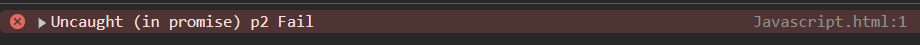

- Don’t get into uncaught errors but write catch statements to handle those errors before the browser catches those errors.

**Case-2.1 : What if p1 and p2 is successful and p3 is failed.**

- Suppose there are three promises, P1, P2, and P3, which take 3 seconds, 1 seconds, and 2 seconds to resolve, respectively.

- In this p3 is failed then promise.all( ) returns result as error after 2 seconds.

### **25.9 Code Examples of Promise.allSettled()**

- It will wait for all the promises to settle, whether they are resolved successfully or rejected. It will collect the result and return it.

Eg-1:

- Suppose there are three promises, P1, P2, and P3, which take 3 seconds, 1 seconds, and 2 seconds to resolve, respectively.

- P1 and p2 are successfully resolved and p3 is failed.

- promise.allSettled( ) waited for all results and it returned an array with all results irrespective of whether it failed or successful.

- It gives reason for rejection.

### **25.10 Code Examples of Promise.race()**

- `Promise.race()` returns the result of the first promise that settles, whether it is resolved successfully or rejected.

**Eg-1:**

- Suppose there are three promises, P1, P2, and P3, which take 3 seconds, 1 seconds, and 2 seconds to resolve, respectively.

- P2 takes less(1 second) time to get settled. P2 is successfully resolved.

**Eg-2:**

- Suppose there are three promises, P1, P2, and P3, which take 3 seconds, 5 seconds, and 2 seconds to resolve, respectively.

- P3 is taking less time to get settled.

- In this case after 2 seconds p3 failed.

- The value or error of the first settled promises returned by promise.race( ).

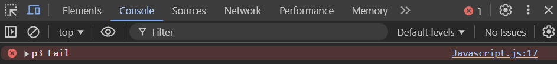

### **25.11 Interview Questions + Difference between settle, resolve, reject, fulfilled**

#### **25.11.1 Settle**

In the context of JavaScript promises, **"settle"** means that a promise has reached its final state, either:

1. **Fulfilled**: The operation completed successfully, and the promise is resolved with a value.

2. **Rejected**: The operation failed, and the promise is rejected with a reason (typically an error).

- A settled promise is no longer in the "pending" state, meaning it has been resolved or rejected and cannot change its state again.

- Settle can be a failure or success.

### **25.12**** Code Examples of Promise.any()**

- Promise.any( ) will wait for first settled success or resolved promise.

**Eg-1: if one promise is failed and other two promises are successful**

- Suppose there are three promises, P1, P2, and P3, which take 3 seconds, 5 seconds, and 2 seconds to resolve, respectively.

- P1 and P2 are resolved successfully but P3 fails in this case.

- P3 failed in 2 seconds but Promise.any( ) will wait for the first promise that is successful. It ignores failed promises.

- P1 is successful at first hence the result if p1 is returned by promise.any( )

**Eg-2: If two promises failed and one is successful**

- Suppose there are three promises, P1, P2, and P3, which take 3 seconds, 5 seconds, and 2 seconds to resolve, respectively.

- P1 and p3 are failed and p2 is successful.

- P2 is successful hence Promise.any( ) returns result of p2.

- After 5 seconds the results of p2 are returned by Promise.any( ).

**Eg-3: All Promises are failed**

- If all promises are failed then Promise.any( ) gives aggregateError( ).

- After 5 seconds it will give aggregate error.

**25.12.1 Handling aggregate errors**

- Errors are returned in the object.

## **26. this keyword in JavaScript 🔥 | Ep.06 - Namaste JavaScript Season 2 🙏**

### **26.1 Introduction**

The `this` keyword behaves differently in various circumstances.

- Inside a function, it behaves one way.

- In the global context, it behaves differently.

- Inside an arrow function, it works differently.

- Inside a nested function, it also behaves differently.

### **26.2 What is covered in this lecture?**

- this in global space

- this inside a function

- this in strict mode - (this substitution)

- this value depends on how this is called (window)

- this inside a object's method

- call apply bind methods(sharing methods)

- this inside arrow function

- this inside nested arrow function

- this inside DOM

### **26.3 “****this” in global space**

- **Global space ** - In JavaScript, the global space refers to the top-level scope where variables and functions declared without a specific scope become properties of the `window` object in browsers or the global object in node.js.

- “This” keyword in global space always has the value of a global object.

- The `this` keyword in the global space represents the global object. The global object differs across JavaScript environments: it is `window` in browsers, `global` in Node.js, and varies in other JavaScript runtimes.

- In the browser, the global object is a window.

- In node.js global object is global.

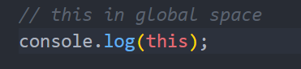

### **26.4  “****this” inside function**

- Value of this keyword inside global space and function is different.

### **26.5 Strict mode**

- This keyword inside function differs in strict mode and non strict mode.

- In strict mode the value of **“this”** keyword is undefined.

- Strict mode has some stricter rules in Javascript.

- Use this inside JS to enter into strict mode.

**Eg-1: **`this`** keyword inside a function in strict mode **

- The `this` keyword inside a function in strict mode is `undefined` by default, unless explicitly set when the function is called.

**Eg-1: **`this`** keyword inside a function in non strict mode - this substitution**

- In non-strict mode the value of “this” keyword is **window**. 

- The value of “this” keyword inside a function depends on strict non strict.

- **This substitution** - it is phenomena according to it the value of **“this”** is undefined or null this will be replaced with global object only in non strict mode.

- Value of “this” keyword is undefined in strict mode but Js will replace undefined with global object in non strict mode.

### **26.5 ****The value of “This” keyword depends on how “this” is called(window) **

- When a function is called without any reference then the value of “this” keyword inside it is **undefined**.

- When a function is called by function name then the value of “this” keyword is undefined.

- When a function is called by using the window keyword then it gives a window object.

### **26.6 this inside a object’s method**

- If a function is made part of an object then it is known as a method.

**Eg-1:**

- The value of** “this”** keyword inside a method which is present inside the object is the object itself.

- x is the method of object **obj.**

**Eg-2: referring to a variable inside an object**

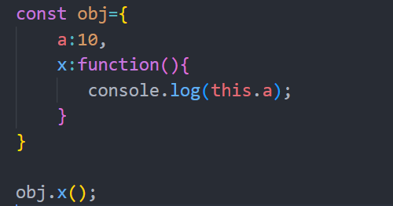

### **26.6 Call, apply and bind methods(sharing methods)**

- There three important functions should be covered while knowing about this keyword.

1. Call

2. Apply

3. Bind

- These methods are used while sharing methods.

- The value of this can be modified by call, apply and bind method.

Link: [Code](https://gist.github.com/ashishpaul99/3b293e8f17ef806f4942fd95e88b6abe)

- Watch call, apply and bind video.

1. **Call( ) Method**

- sharing method between two objects

- Reusing method of one object is shared with another object.

- Overriding the value of this inside a function.

**eg-1:**

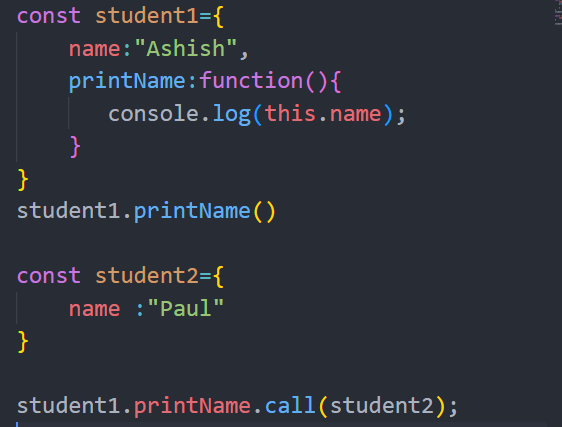

**Eg-2:**

**Eg-2:**

- **apply( ) method**

- The `apply()` method differs from `call()` in the way arguments are passed. 

- In the `apply()` method, arguments are passed as an array or an array-like object, whereas in the `call()` method, arguments are passed individually.

- Instead of passing arguments individually this can be passed using array-like objects.

- **bind( ) method**

- The `bind()` method looks similar to the `call()` method but behaves differently. 

- It creates a new function that is permanently bound to the specified object, and this new function can be invoked later.

-  For example, a copy of the `printFullName` method is created, bound to a specific object, and returned for later use.

- It returns a method which can be called later.

- bind() methods give the copy which can be invoked later.

Eg-1:

**Important Points**

- call( ) method is used to invoke a method directly by passing a reference which points to “this” variable inside the method.

- apply( ) Method is the same as the call method; it takes a second argument as an array list of the parameter.

- bind( ) method will not invoke a method directly but it gives a copy of the exactly same method which can be invoked.

### **26.6 This keyword inside arrow function**

- Arrow function doesn’t have its own “this”.

- They take the value of the lexical environment of the where they are enclosed.

**=> “This” keyword inside the arrow function which is  inside an object will point to the window object. It will not point to the object.**

- **Here ****object is**** present in global space.**

- Hence “this” keyword points to the global object  of its lexical environment which is windows.

### **26.6 “This” keyword inside nested arrow function**

- In this case “this” keyword points to Object itself.. The lexical environment of **arrow function** is the lexical environment of **function** in which it is enclosed. The Lexical environment of function is global. Hence “this” keyword inside the nested function points to the global object(window).

**eg-1:**

### **26.7 “This” keyword inside DOM**

- “This” inside DOM elements is reference to the HTML element.

**eg-1:**

- By clicking the button it alters and prints the value of this.

- “This” in this case refers to the HTML button element.

- The value of "this” keyword inside the alert function is the element itself.

- Element itself is the value of “this” keyword.

### **Eg-2:**

- Read about Constructors, OOP’s, classes.

## 